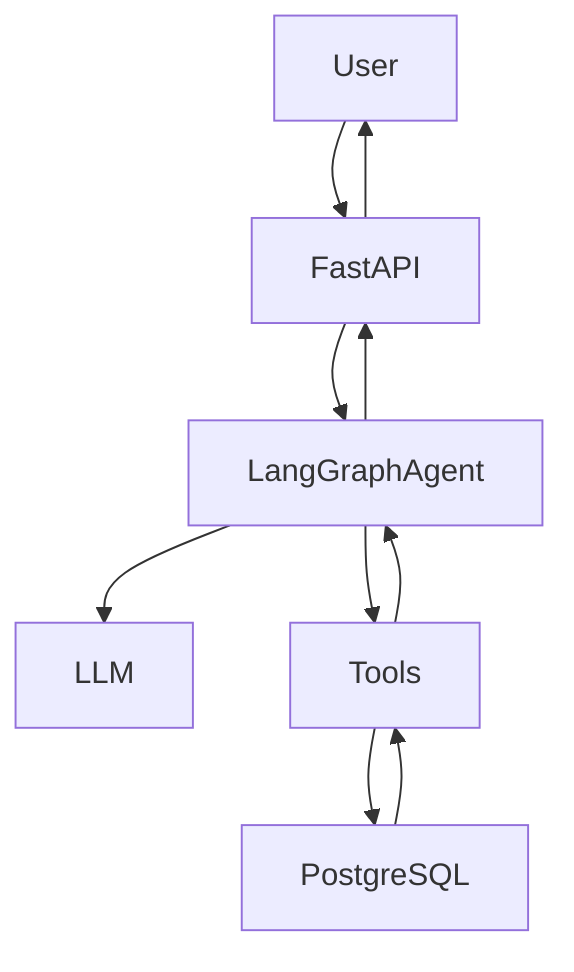

# stayease-ai-agent

## 1.1 System Overview

StayEase AI Agent is a conversational assistant that helps users search for rental properties, view listing details, and make bookings. 

The system uses a LangGraph-based agent to manage conversation flow and decision-making. A FastAPI backend receives user messages and forwards them to the agent. The agent uses an LLM (via Groq/OpenRouter) to understand intent and decide which tool to call. Tools interact with a PostgreSQL database to fetch listings, retrieve details, or create bookings.

If the request is outside supported actions (search, details, booking), the system escalates to a human.



## 1.2 Conversation Flow

Example: User searches for a property

User Input:
"I need a room in Cox's Bazar for 2 nights for 2 guests"

Step-by-step flow:

1. User sends message to FastAPI endpoint.
2. FastAPI forwards the message and conversation_id to the LangGraph agent.
3. The agent stores the message as `user_message` in state.
4. The parse_intent node uses the LLM to extract:
   - intent: "search"
   - location: "Cox's Bazar"
   - guests: 2
   - dates: 2 nights (check-in/check-out inferred or clarified)
5. The route_node checks the intent.
6. Since intent = "search", it routes to tool_node.
7. The tool_node calls `search_available_properties`.
8. The tool queries PostgreSQL and returns available listings with prices.
9. The result is stored in `tool_result`.
10. The response_node formats a natural language reply using the LLM.
11. FastAPI returns the final response to the user.

## 1.3 LangGraph State Design

```python
from typing import TypedDict, Optional, Dict, Any

class AgentState(TypedDict):
    user_message: str
    intent: Optional[str]
    location: Optional[str]
    checkin_date: Optional[str]
    checkout_date: Optional[str]
    guests: Optional[int]
    listing_id: Optional[int]
    tool_result: Optional[Dict[str, Any]]
    response: Optional[str]
```
## ✍️ Add explanation right after:

```markdown
- user_message → latest user input
- intent → determines which action (search/details/book)
- location → required for searching listings
- checkin_date → booking start date
- checkout_date → booking end date
- guests → number of guests for filtering
- listing_id → identifies selected property
- tool_result → stores output from tool calls
- response → final reply returned to user
```

## 1.4 Node Design

### 1. parse_intent
- Extracts intent and entities from the user message using LLM
- Updates: intent, location, checkin_date, checkout_date, guests, listing_id
- Next: route_node

### 2. route_node
- Decides which action to take based on intent
- Updates: none
- Next: tool_node or fallback_node

### 3. tool_node
- Calls the appropriate tool (search, details, booking)
- Updates: tool_result
- Next: response_node

### 4. response_node
- Formats tool output into a user-friendly response using LLM
- Updates: response
- Next: END

### 5. fallback_node
- Handles unsupported requests by escalating to a human
- Updates: response
- Next: END


## 1.5 Tool Definitions

### 1. search_available_properties
```
Input:
{
  "location": "string",
  "checkin_date": "string",
  "checkout_date": "string",
  "guests": "int"
}

Output:
[
  {
    "listing_id": 101,
    "title": "Sea View Apartment",
    "price_per_night": 4500
  }
]

Used when:
User wants to search for available properties.
```

### 2. get_listing_details
```
Input:
{
  "listing_id": "int"
}

Output:
{
  "listing_id": 101,
  "title": "Sea View Apartment",
  "description": "Ocean-facing apartment with balcony",
  "price_per_night": 4500,
  "max_guests": 4
}

Used when:
User asks for details of a specific listing.
```

### 3. create_booking
```
Input:
{
  "listing_id": "int",
  "checkin_date": "string",
  "checkout_date": "string",
  "guests": "int"
}

Output:
{
  "booking_id": 5001,
  "status": "confirmed",
  "total_price": 9000
}

Used when:
User confirms a booking.
```

## 1.6 Database Schema Design

### listings
- id (INTEGER, PRIMARY KEY)
- title (TEXT)
- location (TEXT)
- price_per_night (INTEGER)
- max_guests (INTEGER)
- description (TEXT)

### bookings
- id (INTEGER, PRIMARY KEY)
- listing_id (INTEGER, FOREIGN KEY)
- checkin_date (DATE)
- checkout_date (DATE)
- guests (INTEGER)
- total_price (INTEGER)

### conversations
- id (TEXT, PRIMARY KEY)
- messages (JSONB)
- created_at (TIMESTAMP)

## Setup

1. Clone the repo
2. Create virtual environment: `python -m venv venv && source venv/bin/activate`
3. Install dependencies: `pip install -r requirements.txt`
4. Copy `.env.example` to `.env` and add your Groq API key
5. Run: `uvicorn main:app --reload`