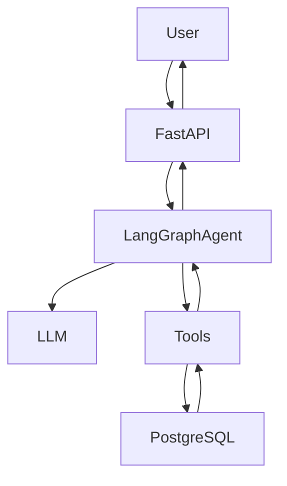

# stayease-ai-agent

## 1.1 System Overview

StayEase AI Agent is a conversational assistant that helps users search for rental properties, view listing details, and make bookings. 

The system uses a LangGraph-based agent to manage conversation flow and decision-making. A FastAPI backend receives user messages and forwards them to the agent. The agent uses an LLM (via Groq/OpenRouter) to understand intent and decide which tool to call. Tools interact with a PostgreSQL database to fetch listings, retrieve details, or create bookings.

If the request is outside supported actions (search, details, booking), the system escalates to a human.

## 1.2 Conversation Flow

Example: User searches for a property

User Input:
"I need a room in Cox's Bazar for 2 nights for 2 guests"

Step-by-step flow:

1. User sends message to FastAPI endpoint.
2. FastAPI forwards the message and conversation_id to the LangGraph agent.
3. The agent stores the message as `user_message` in state.
4. The parse_intent node uses the LLM to extract:
   - intent: "search"
   - location: "Cox's Bazar"
   - guests: 2
   - dates: 2 nights (check-in/check-out inferred or clarified)
5. The route_node checks the intent.
6. Since intent = "search", it routes to tool_node.
7. The tool_node calls `search_available_properties`.
8. The tool queries PostgreSQL and returns available listings with prices.
9. The result is stored in `tool_result`.
10. The response_node formats a natural language reply using the LLM.
11. FastAPI returns the final response to the user.